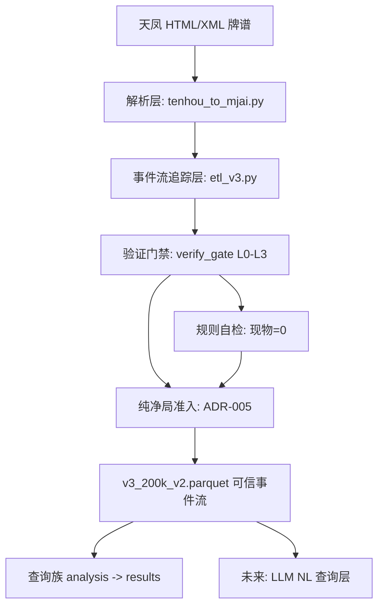
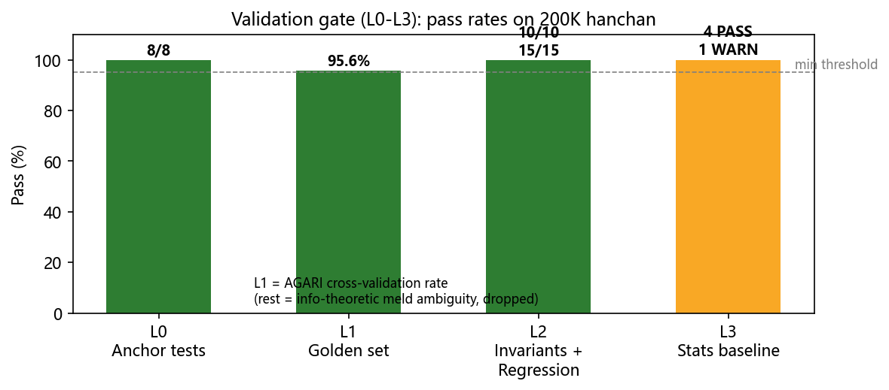
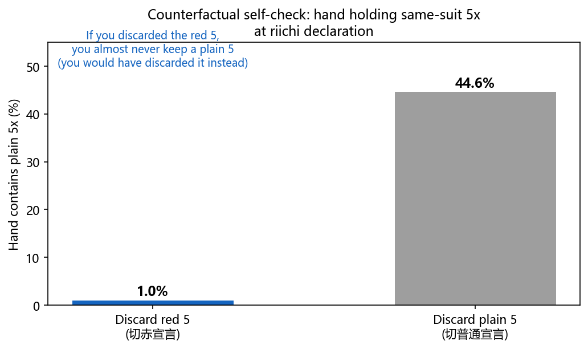
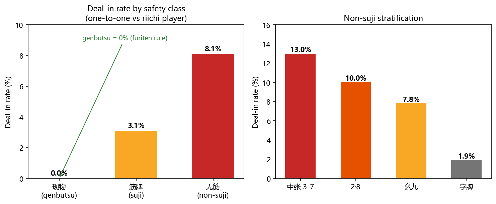

# Riichi Database — 天凤数据库的可信事件流数据层

> **为 LLM 自然语言查询的天凤数据库构建可信数据底座**：从天凤 HTML 牌谱解析出经过严格验证的数据库事件流。
> 核心问题不是"得出什么结论"，而是**"如何证明解析出的事件流是准确的"**——统计结论只是可信度的旁证。


---

## 项目定位

| 层 | 说明 |
|----|------|
| **最终目标** | 支持 LLM 自然语言查询的天凤数据库（NL 查询 → 可信统计）|
| **本项目** | 数据底座层：从 HTML 牌谱到**可信事件流**的完整管线与验证体系 |
| **核心信念** | LLM 查询的结论质量 **≤ 数据质量**——数据不可信，一切上层皆不可信 |

---

## 背景与动机

天凤（tenhou.net）公开牌谱（HTML/XML）是研究日麻策略的宝贵数据源。但要支撑 **LLM 自然语言查询**（如"早巡切过 5 的立直，同色 1-4 铳率如何"），前提是底层事件流**绝对可信**——任何解析错误都会系统性污染所有查询结论。

本项目即为此构建**可信数据层**，核心贡献是**"从 HTML 到可信数据库"的完整方法论**：解析 → 追踪 → 验证 → 准入。

---

## 方法论：从 HTML 到可信数据库（核心）



### 1. 解析层（`pipeline/tenhou_to_mjai.py`）

将 HTML/XML 牌谱按**权威 mjlog 位布局**解码为事件流。历史上发现并修复 **11 个结构性 bug**：

| Bug | 修复 | 验证 |
|-----|------|------|
| 副露 m 解码错误（低 2 位误当类型，实为来源座位）| 权威位布局重写 | 手牌守恒 golden test |
| 赤牌 ID 判定错误（`cp==3` 判赤，实为普通第 4 张）| 赤牌 = ID 16/52/88（`id%4==0`）| 300 文件端到端 0 失配 |
| 副露 consumed 副本 ID 追踪错误（推导 31.8% 失败）| 按类别移除（m 字段不编码副本）| meld 失败 31.8% → 0 |
| 国士/七对听牌漏判、dora 循环漏 N 等 8 项 | 逐一修复 | INV-2 PASS |

**可信依据**：与 kobalab/tenhou-log（天凤官方解析器）权威源码逐行对照，而非自创解码。

### 2. 事件流追踪层（`pipeline/etl_v3.py`）

- 全状态追踪：手牌 / 牌河 / 已见 / 向听 / 听牌形 / 副露序列 / 局况 / 收支
- **局限显式化**（不掩盖）：副露赤牌 ID 不可恢复（m 字段信息论极限）、杠后手切岭上内容未知——文档记录，查询时注意

### 3. 验证层（门禁体系，`analysis/gate/verify_gate.py`）

| 门禁 | 内容 | 拦截 |
|------|------|------|
| L0 锚点测试 | 8 个 golden cases（国士/抢杠/副露守恒）| 函数级错误 |
| L1 黄金样本集 | 200 个覆盖稀有场景 XML，AGARI 交叉验证 ≥95% | 稀有场景解析错误 |
| L2 不变量 + 回归 | INV-1..10 + P1-P15 | 常规系统性错误 |
| L3 统计基准 | 7 项指标 vs nodocchi 凤凰卓基准 | 统计偏差 |



### 4. 规则自检（方法论亮点：用游戏规则验证数据）

| 自检 | 原理 | 结果 |
|------|------|------|
| **现物 = 0** | 对一家立直的现物（其全部舍牌+宣言后他家舍牌）按振听规则**铳率必须精确为 0**——非零即解析 bug | ✅ 0.000% |
| **赤牌反事实** | 切赤 5 宣言者手里几乎不可能有普通 5x（否则会切普通留赤）| ✅ 1.0% vs 44.6% |
| **役种率锚定** | 平和/七对/三色率 vs 权威基准 | ✅ 3 PASS |



**统计口径规范**（贯穿所有查询）：
- **一对一铳率**：放铳率固定目标立直家（仅其最终荣和时）
- **局级去重**：和率/放铳率按局计（行级会因 backfill 重复虚高）
- **时点判定**：用全局事件序号（`turn` 跨家不可比，副露后不递增）

### 5. 准入层（纯净原则，ADR-005）

> **只有当一个小局（kyoku）的全部动作都验证合法时，该局才能进入数据库。数据纯净性优先于数据量。**

- 副本歧义局（信息论极限 ~3.8%）整局丢弃，不降级入库
- 丢弃不静默（审计日志），原始 XML 保留

---

## 验证结果：事件流可信度证明

### 交叉验证

| 验证 | 结果 |
|------|------|
| AGARI 交叉验证（和牌手牌 vs 事件流）| **95.6%**（其余 3.8% 为信息论极限，已丢弃）|
| 不变量 INV-1..10 | **10/10 PASS**（2000 万行）|
| 回归探针 P1-P15 | **15/15 PASS** |
| 赤牌 ID 端到端 | **0 失配**（300 文件 143,859 摸牌）|
| 副露移除失败率 | **0**（修复前 31.8%）|

### 权威基准锚定（vs nodocchi 凤凰卓，270 玩家 / 2000 万局）

| 指标 | 观测 | nodocchi 基准 | 判定 |
|------|------|--------------|------|
| 和率 | 21.1% | 21.9% | ✅ 段位差内 |
| 铳率 | 12.5% | 13.1% | ✅ |
| 立直率 | 18.7% | 18.2% | ✅ |
| 自摸率 | 40.9% | 40.4% | ✅ |
| 赤宝率 | 47.4% | 49.8% | ✅ 段位差内 |
| 平和率 | 20.3% | 20.5% | ✅ |
| 七对率 | 2.9% | 2.9% | ✅ |

### 安全度梯度（可信度的旁证：领域规律可复现）



---

## 统计结论（作为"事件流可信"的旁证）

> 这些结论的意义在于：**能复现日麻领域公认规律 = 数据可信**。完整结果见 [results/RESULTS_README.md](results/RESULTS_README.md)。

| 查询族 | 代表性结论 |
|--------|-----------|
| 安全度（b2）| 现物 0% < 筋 3.1% < 无筋 8.1%；中张无筋 13.0% 最危险 |
| 赤牌（aka）| 切赤 5 后同色 5x 听牌率 0%；端牌 1/9 听牌增多 |
| 副露（v/furo_seq）| 役牌流收支 +393 vs 食断 -125；伪染手听牌率 76% |
| 时机（inferred）| 向听 0 放铳给立直家 4.0% vs 向听 3 仅 0.8% |
| 立直（hata）| 切 3 种中张 → 一向听率 57.6%（0 种仅 23.6%）|

---

## 快速开始

> 本仓库不含原始数据（大文件不入库）。数据获取脚本不在仓库内，需自行从天凤公开牌谱下载 XML。

```powershell
# 1. 获取数据：天凤公开牌谱 XML（354K 局，见 tenhou.net）
#    （下载工具不在本仓库；games/ 目录放置 XML 文件）

# 2. 转换 + ETL（pipeline/）
python pipeline/tenhou_to_mjai.py <input.xml>          # XML → mjai 事件流
python pipeline/etl_v3.py --input games_200k_v2 --out v3_200k_v2.parquet --workers 4

# 3. 验证（门禁全链路，修改后必跑）
python analysis/gate/run_guarded.py analysis/gate/verify_gate.py --all --data v3_200k_v2.parquet

# 4. 跑查询（半庄级均匀抽样）
python analysis/gate/run_guarded.py analysis/queries/b2_queries.py
```

**环境**：Python 3.13+（polars ≥1.40, psutil, matplotlib）；`run_guarded.py`/`verify_gate.py` 中的 `PY` 常量为 Windows Python 路径，按环境修改。

---

## 目录与文件导航

```
├── pipeline/                  # 数据管线（核心）
│   ├── tenhou_to_mjai.py      # XML→mjai 转换器（权威 m 解码 + 赤牌 ID）
│   ├── etl_v3.py              # ETL（手牌/牌河/听牌追踪 + 局级准入）
│   ├── invariant_check.py     # 不变量校验（INV-1..10）
│   └── regression_probes.py   # 回归探针（P1-P15）
├── analysis/
│   ├── queries/               # 查询族（每族独立脚本）
│   │   ├── b2_queries.py      # 听14立直/早外/现物筋无筋/摸切手切
│   │   ├── b3_queries.py      # 切dora/切赤牌收支/七对
│   │   ├── v_queries2.py      # 副露大类识别（役牌/染手/食断/客风）
│   │   ├── furo_seq_queries.py# 真伪染手/第二副露/全带系
│   │   ├── hata_queries.py    # 初打持有率/初打向听/切中张种类
│   │   ├── inferred_queries.py# 押し引き/立直家数/副露追立/时机/流局
│   │   ├── l3_queries.py      # 染手听牌/幺九字听牌/碰吃听牌形
│   │   ├── pattern_queries.py # 相邻手切/溢出/染手信号
│   │   ├── reading_queries.py # 二次副露切牌/切邻牌dora
│   │   └── q1_v2.py           # 恰听14+dora1+平和先制
│   ├── aka/                   # 赤牌专项分析 + 反事实自检
│   ├── sanity/                # 统计基准验证（stats_sanity/役种率）
│   └── gate/                  # 门禁体系（verify_gate L0-L3 + 内存护栏）
├── results/                   # ★ 统计结果 JSON + 解读索引
├── data/                      # 基准（nodocchi）与黄金样本集
├── docs/                      # 核心文档
│   ├── EVALUATION.md          # 管线完整性评估（11 bug + 验证）
│   ├── STATS_BASELINE.md      # 统计基准明细
│   ├── GAME_MODEL.md          # 数据模型规范 v3.5
│   ├── AUDIT_TILE_ID.md       # 牌 ID/赤牌审计
│   ├── TENHOU_RULES.md        # 天凤规则（权威对照）
│   ├── ADR.md                 # 架构决策（含门禁/护栏）
│   └── img/                   # README 可视化图
└── LICENSE                    # MIT
```

---

## 已知局限与可信度分级

| 分级 | 说明 |
|------|------|
| ✅ **可直接引用** | 现物/筋/无筋铳率、赤牌摸切、不变量、役种率、基础统计（和率/铳率/立直率）|
| ⚠️ **需注意** | 副露赤牌相关（m 字段不编码副本 ID，不可恢复）；杠后手切岭上内容；段位差（基准为凤凰卓，我们的数据可能含低段位，±2pp）|
| ❌ **不可用** | 副露 consumed 具体副本 ID（信息论极限，已被纯净原则丢弃）|

---

## 路线图

1. ✅ 数据底座层（本仓库）：可信事件流 + 验证体系 + 统计结果
2. ⏳ **LLM 自然语言查询层**：基于可信事件流，构建 NL → 统计查询的推理层
3. ⏳ 全量数据扩展（899K 半庄）与在线更新

---

## 数据来源与致谢

- 天凤（tenhou.net）公开牌谱数据（学术研究用途）
- nodocchi.moe Phoenix DB 统计基准（天凤凤凰卓玩家统计）
- mjlog 权威解析参考：kobalab/tenhou-log

## 参与贡献

- 报告问题 / 建议功能：见 [Issue 模板](.github/ISSUE_TEMPLATE/bug_report.md)
- 提交代码：见 [CONTRIBUTING.md](CONTRIBUTING.md)（修改后必跑门禁，遵循统计口径规范）
- CI：语法检查 + 数据文件校验自动运行

## License

MIT（见 [LICENSE](LICENSE)）。数据归天凤所有。
