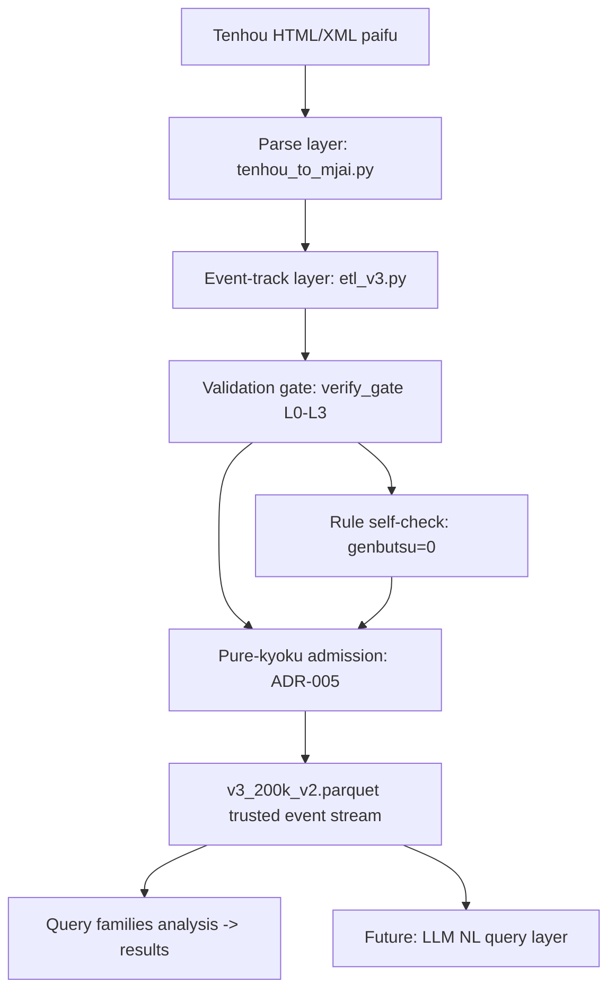

# Riichi Database — Trusted Event-Stream Data Layer for a Tenhou Database

> **Building a trusted data foundation for an LLM-powered natural-language Tenhou database**: parsing Tenhou HTML paifu into a rigorously validated database event stream.
> The core question is not "what conclusions we derive" but **"how we prove the parsed event stream is accurate"** — statistical findings serve as evidence of trustworthiness.


---

## Positioning

| Layer | Description |
|-------|-------------|
| **End goal** | LLM-powered natural-language Tenhou database (NL query → trusted statistics) |
| **This project** | Data foundation layer: full pipeline + validation system from HTML paifu to **trusted event stream** |
| **Core belief** | Quality of LLM answers **≤ quality of data** — untrustworthy data poisons everything above |

---

## Background & Motivation

Tenhou (tenhou.net) publishes public paifu (HTML/XML) — an invaluable source for riichi mahjong strategy research. To power **LLM natural-language queries** (e.g., "what is the deal-in rate of same-suit 1-4 after an early 5 discard + riichi"), the underlying event stream must be **absolutely trustworthy** — any parse error systematically pollutes every downstream answer.

This project builds that **trusted data layer**. The core contribution is the **methodology of "from HTML to trusted database"**: parse → track → validate → admit.

---

## Methodology: From HTML to Trusted Database (Core)



### 1. Parse Layer (`pipeline/tenhou_to_mjai.py`)

Decodes HTML/XML paifu into an event stream per the **authoritative mjlog bit layout**. Historically 11 structural bugs were found and fixed:

| Bug | Fix | Validation |
|-----|-----|-----------|
| Meld m-decode error (low 2 bits = seat, not type) | Authoritative bit-layout rewrite | Hand-conservation golden test |
| Red-five ID error (`cp==3` vs authoritative `id%4==0`) | Aka = IDs 16/52/88 | 0 mismatch, 300 files end-to-end |
| Meld consumed copy-ID tracking error (31.8% fail) | Category-based removal (m encodes no copy) | Meld-fail 31.8% → 0 |
| Kokushi/chiitoi wait misses, dora-loop off-by-one, etc. | Fixed individually | INV-2 PASS |

**Trust basis**: line-by-line comparison against kobalab/tenhou-log (authoritative Tenhou parser) — no self-invented decoding.

### 2. Event-Track Layer (`pipeline/etl_v3.py`)

- Full state tracking: hand / river / visible / shanten / wait shapes / meld sequence / kyoku context / score deltas
- **Limitations made explicit**: meld red-five IDs unrecoverable (info-theoretic limit of m field), post-kan hand-discard unseen content — documented, flagged in queries

### 3. Validation Gate (L0-L3, `analysis/gate/verify_gate.py`)

| Gate | Content | Catches |
|------|---------|---------|
| L0 anchor tests | 8 golden cases (kokushi/robbing-kan/meld conservation) | Function-level errors |
| L1 golden set | 200 XML covering rare scenarios, AGARI cross-validation ≥95% | Rare-scenario parse errors |
| L2 invariants + regression | INV-1..10 + P1-P15 | Systematic errors |
| L3 stats baseline | 7 metrics vs nodocchi Phoenix baseline | Statistical drift |


### 4. Rule Self-Checks (methodology highlight: use game rules to validate data)

| Check | Principle | Result |
|-------|-----------|--------|
| **Genbutsu = 0** | A genbutsu tile vs a riichi player (their discards + post-riichi discards) **must have exactly 0 deal-in rate** (furiten rule) — non-zero means parse bug | ✅ 0.000% |
| **Red-five counterfactual** | A player discarding red 5 almost never holds a plain 5 (they'd discard the plain one instead) | ✅ 1.0% vs 44.6% |
| **Yaku-rate anchoring** | Pinfu/chiitoi/sanshoku rates vs authoritative baseline | ✅ 3 PASS |


**Statistical conventions** (applied across all queries):
- **One-to-one deal-in rate**: deal-in fixed to the target riichi player (only when they win by ron)
- **Kyoku-level dedup**: win/deal-in rates counted per kyoku (row-level inflates via backfill)
- **Temporal ordering**: global event index (per-player `turn` is not comparable across seats)

### 5. Admission Layer (Purity Principle, ADR-005)

> **A kyoku enters the database only if all its actions validate. Data purity outranks data volume.**

- Copy-ambiguity kyoku (info-theoretic ~3.8%) dropped wholesale, never degraded into the DB
- Drops are audited (not silent); raw XML retained

---

## Validation Results: Proving Event-Stream Trustworthiness

### Cross-validation

| Check | Result |
|-------|--------|
| AGARI cross-validation (winning hand vs event stream) | **95.6%** (rest = info-theoretic limit, dropped) |
| Invariants INV-1..10 | **10/10 PASS** (20M rows) |
| Regression probes P1-P15 | **15/15 PASS** |
| Red-five ID end-to-end | **0 mismatch** (300 files, 143,859 draws) |
| Meld removal failure | **0** (was 31.8%) |

### Authoritative baseline anchoring (vs nodocchi Phoenix, 270 players / 20M games)

| Metric | Observed | nodocchi baseline | Verdict |
|--------|----------|-------------------|---------|
| Win rate | 21.1% | 21.9% | ✅ within dan gap |
| Deal-in rate | 12.5% | 13.1% | ✅ |
| Riichi rate | 18.7% | 18.2% | ✅ |
| Tsumo share | 40.9% | 40.4% | ✅ |
| Red-dora share | 47.4% | 49.8% | ✅ within dan gap |
| Pinfu share | 20.3% | 20.5% | ✅ |
| Chiitoi share | 2.9% | 2.9% | ✅ |

### Safety gradient (evidence of trustworthiness: domain laws reproduce)


---

## Statistical Findings (as evidence of event-stream trustworthiness)

> These findings matter because **reproducing established riichi domain laws = trusted data**. Full results: [results/RESULTS_README.md](results/RESULTS_README.md).

| Family | Representative finding |
|--------|------------------------|
| Safety (b2) | genbutsu 0% < suji 3.1% < non-suji 8.1%; middle non-suji 13.0% most dangerous |
| Aka (aka) | after red-5 discard, same-suit 5x wait rate 0%; terminals 1/9 waits increase |
| Melds (v/furo_seq) | yakuhai-flow +393 vs tanyao-flow -125 pts; pseudo-dye tenpai 76% |
| Timing (inferred) | deal-in to riichi 4.0% at tenpai vs 0.8% at 3-shanten |
| Riichi (hata) | 3 middle-tile types cut → iishanten rate 57.6% (0 types: 23.6%) |

---

## Quick Start

> Raw data is not included (large files excluded from repo). Download scripts are **not** in this repo; obtain Tenhou public XML paifu yourself.

```powershell
# 1. Obtain data: Tenhou public paifu XML (354K games, see tenhou.net)
#    (downloader not in this repo; place XML under games/)

# 2. Convert + ETL (pipeline/)
python pipeline/tenhou_to_mjai.py <input.xml>          # XML → mjai event stream
python pipeline/etl_v3.py --input games_200k_v2 --out v3_200k_v2.parquet --workers 4

# 3. Validate (full gate, run after any change)
python analysis/gate/run_guarded.py analysis/gate/verify_gate.py --all --data v3_200k_v2.parquet

# 4. Run queries (hanchan-level uniform sampling)
python analysis/gate/run_guarded.py analysis/queries/b2_queries.py
```

**Requirements**: Python 3.13+ (polars ≥1.40, psutil, matplotlib); `PY` constant in `run_guarded.py`/`verify_gate.py` is a Windows-specific Python path — adjust per environment.

---

## Layout & File Guide

```
├── pipeline/                  # Data pipeline (core)
│   ├── tenhou_to_mjai.py      # XML→mjai converter (authoritative m decode + aka ID)
│   ├── etl_v3.py              # ETL (hand/river/wait tracking + kyoku admission)
│   ├── invariant_check.py     # Invariant checks (INV-1..10)
│   └── regression_probes.py   # Regression probes (P1-P15)
├── analysis/
│   ├── queries/               # Query families (one script per family)
│   ├── aka/                   # Red-five analysis + counterfactual self-check
│   ├── sanity/                # Stats baseline validation
│   └── gate/                  # Validation gate (L0-L3 + memory guard)
├── results/                   # ★ Statistical results JSON + index
├── data/                      # Baseline (nodocchi) + golden set
├── docs/                      # Core documentation (evaluation/model/rules/ADR)
│   └── img/                   # README charts
└── LICENSE                    # MIT
```

---

## Known Limitations & Confidence Grading

| Grade | Description |
|-------|-------------|
| ✅ **Directly citable** | genbutsu/suji/non-suji rates, red-five draws, invariants, yaku rates, core stats (win/deal-in/riichi) |
| ⚠️ **Use with care** | meld red-five related (m field encodes no copy ID); post-kan hand-discard unseen content; dan gap (baseline = phoenix room, our data may include lower dan, ±2pp) |
| ❌ **Not usable** | specific copy IDs of meld consumed tiles (info-theoretic limit; dropped by purity principle) |

---

## Roadmap

1. ✅ Data foundation layer (this repo): trusted event stream + validation system + statistical results
2. ⏳ **LLM natural-language query layer**: NL → statistical query reasoning on the trusted event stream
3. ⏳ Full-data expansion (899K hanchan) and online updates

---

## Data Sources & Credits

- Tenhou (tenhou.net) public paifu data (academic research use)
- nodocchi.moe Phoenix DB statistical baseline
- mjlog authoritative reference: kobalab/tenhou-log

## Contributing

- Report bugs / suggest features: see [Issue templates](.github/ISSUE_TEMPLATE/bug_report.md)
- Submit code: see [CONTRIBUTING.md](CONTRIBUTING.md) (run validation gates after changes; follow statistical conventions)
- CI: syntax checks + data-file validation run automatically

## License

MIT (see [LICENSE](LICENSE)). Data belongs to Tenhou.
